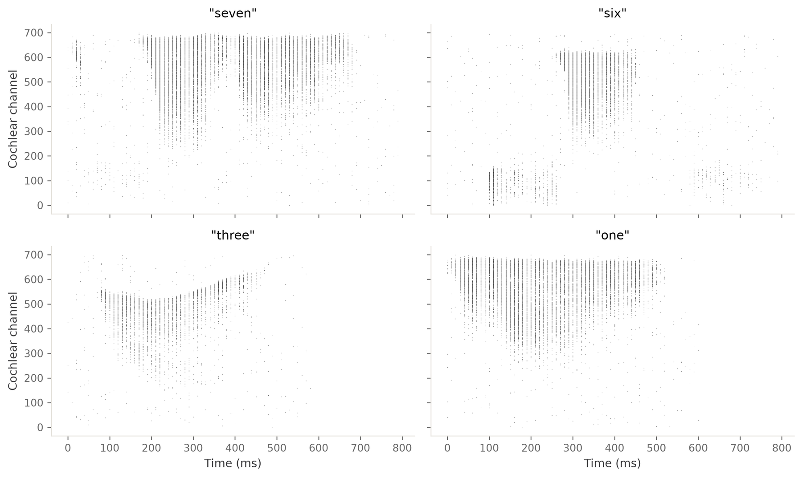
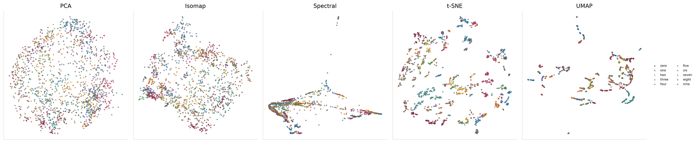
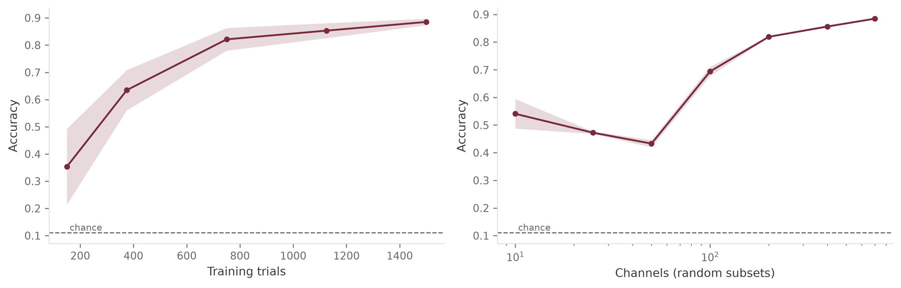
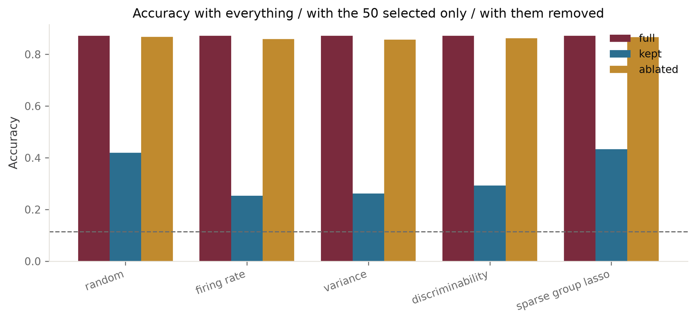
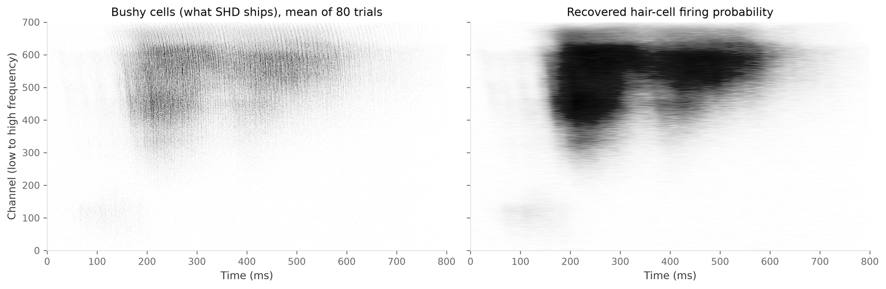

# ML approaches for decoding and interpreting neural population activity

**Summer School in Computational Biology 2026 — University of Coimbra**

Renato Duarte · CNC, CiBB, University of Coimbra
renato.duarte@cnc.uc.pt

Seven students · basic Python, no neuroscience background required · **laptop only** — no cluster, no GPU, no data-access paperwork.

---

## The problem

Neural population recordings are high-dimensional, redundant, and rarely interpretable at face value. The working hypothesis of modern systems neuroscience is that computation lives in a small number of latent modes shared across many neurons, rather than in individual cells. That hypothesis licenses almost all population-level analysis, and it is usually **assumed rather than tested**.

Three consequences, and they are the substance of this project:

1. **Structure is method-dependent.** PCA, UMAP, Isomap and t-SNE impose different assumptions. Whether the class structure survives all of them is an empirical question.
2. **Visible structure is not usable structure.** A separation you can see in three dimensions may be an artefact of the projection. Decoding accuracy is a common, defensible currency.
3. **Decodability does not localise.** Knowing information is present says nothing about what carries it — and in a redundant code, the obvious answer is frequently wrong.

The payoff is the relationship between the three: **does any geometric property of a representation predict what a downstream linear reader can extract, and can that capacity be traced to an identifiable subspace?**

## The data

**Spiking Heidelberg Digits** — spoken digits pushed through a biophysical model of the inner ear and emitted as spike trains: ~700 channels, ~10 000 trials, 20 classes, 12 speakers. The answer is known for every trial, so every structural claim is checkable.



*Four single trials. Each dot is one spike. Channel index is **tonotopic** — it maps monotonically onto frequency — so the diagonal sweeps are formant transitions. The structure is visible by eye; whether it is **usable** is the question the project answers.*

## Quick start

```shell
git clone https://github.com/CNNC-Lab/compbio-2026.git
cd compbio-2026
conda env create -f environment.yml     # or: mamba env create -f environment.yml
conda activate compbio-2026
jupyter lab notebooks/01_data.ipynb
```

The dataset downloads itself on first use and is cached in `data/`. Nothing else to fetch.

```python
from compbio2026 import data, geometry, decoding, selection, plotting

plotting.apply_style()
shd = data.load("train")
X, y, t = data.build_design_matrix(shd, bin_ms=25.0)   # (trials, channels, bins)

geometry.summarize(data.flatten(X), y)                 # participation ratio, class separation, ...
decoding.decode(data.flatten(X), y)                    # accuracy with its chance level
selection.compare_selectors(X, y, k=50)                # sparse group lasso vs. heuristics, ablated
```

Full instructions, including what to do when something breaks: **[docs/00-setup.md](docs/00-setup.md)**.

---

## The notebooks

Five, in order. Every one is executed in this repository, so you can read the outputs before running anything.

| | Notebook | What you get out of it |
|---|---|---|
| **1** | [The data](notebooks/01_data.ipynb) | What SHD is, and the two preprocessing choices that are scientific decisions rather than defaults |
| **2** | [Geometry](notebooks/02_geometry.ipynb) | Five embeddings, one table, and the shuffled-label control that makes the table mean something |
| **3** | [Decoding](notebooks/03_decoding.ipynb) | Accuracy with its controls; the published baseline reproduced; **the redundancy result** |
| **4** | [Interpretability](notebooks/04_interpretability.ipynb) | Sparse group lasso, the heuristics it must beat, and ablation as the necessity test |
| **5** | [Hair cells](notebooks/05_hair_cells.ipynb) | Recovering the layer of the inner-ear model underneath the data |

### 1–2 · Structure

Every dimensionality-reduction method tells a different story about the same data. t-SNE and UMAP look the most convincing, which is exactly why they are dangerous: distances *between* clusters in those embeddings are not meaningful.



So the deliverable of Stage 1 is a table of numbers — participation ratio, class separation, trustworthiness — not a gallery of pictures. See **[docs/03-dimensionality-reduction.md](docs/03-dimensionality-reduction.md)** for what each method assumes and where it misleads.

### 3 · Decodability

Train a linear readout, and give every number its controls: chance level, a shuffled-label null, a speaker-held-out split.



*The right-hand panel is the important one. Accuracy is near its ceiling with a small fraction of the 700 channels — **the code is massively redundant**. That fact drives everything in notebook 4.*

### 4 · Which subspace carries the digit

The naive question is "which neurons?", and it is the wrong unit. A population code is distributed: stimulus identity lives in a **shared subspace**, not in a list of important cells. Sparse group lasso (one group per cochlear channel) gives a candidate basis for that subspace; ablation tests whether it is necessary.



*Remove the 50 channels a selector called essential and the decoder barely notices — the remaining 650 carry the same information. **That number is the result**, not a failed experiment. It is the honest, quantitative answer to "which neurons matter?" in a distributed code.*

> **Required framing, to be stated explicitly in your report:** selection and ablation here establish causal relevance **for the decoder, not for the circuit**. The data are fixed recordings and nothing is intervened upon in the biological system. Distinguishing decoder-causality from circuit-causality is a live confusion in the interpretability literature, and getting it right is part of the assessment.

### 5 · Recovering the hair-cell layer

SHD ships only the last stage of the [LAUSCHER](https://github.com/electronicvisions/lauscher) chain:

```
audio ──► basilar membrane ──► hair cell ──► bushy cell ──► SHD
                               (Meddis)      (LIF, 40 afferents)
                               continuous     spikes
                               probability
```

The hair-cell stage emits a continuous *firing probability*, and bushy cells map **one-to-one** onto hair-cell channels — the 40 afferents are stochastic draws *within* a channel, not a fan-in across channels. That makes recovery a well-posed per-channel inverse problem: measure the forward map by simulating the published bushy-cell model, then invert it.



It works, with limits that are part of the science rather than footnotes to it — a refractory ceiling that censors high rates, a smoothing kernel that *is* the time resolution, and a rate that identifies the model's output but not its internal state. See **[docs/04-hair-cell-recovery.md](docs/04-hair-cell-recovery.md)**.

---

## Three routes

Pick one and justify the choice. They are different projects, not difficulty levels.

| | Route | Finishes in 10 days | Simulation | Ground truth |
|---|---|---|---|---|
| **A** | Analyse this population directly | reliably | no | yes |
| **B** | Use it as input to a biophysical circuit; analyse the second layer | if disciplined | yes | no |
| **C** | Decompose across layers of the auditory pathway | yes, for the recovery direction | some | yes, via LAUSCHER |

Trade-offs and risks: **[docs/05-routes.md](docs/05-routes.md)**.

## Documentation

| | |
|---|---|
| [00 · Setup](docs/00-setup.md) | Install, download, troubleshoot |
| [01 · Dataset](docs/01-dataset.md) | What SHD is, where the channels come from, the splits that matter |
| [02 · Stages](docs/02-stages.md) | What each stage is for, and what doing it well looks like |
| [03 · Dimensionality reduction](docs/03-dimensionality-reduction.md) | What each method assumes and where it misleads |
| [04 · Hair-cell recovery](docs/04-hair-cell-recovery.md) | The inverse problem, its limits, and how to validate it |
| [05 · Routes](docs/05-routes.md) | Three ways through the project |
| [06 · Reading](docs/06-reading.md) | Three starred papers, and the rest on demand |

## Layout

```
src/compbio2026/     data · geometry · decoding · selection · lauscher · plotting
notebooks/           five executed notebooks
docs/                setup, dataset, stages, methods, recovery, routes, reading
tools/               SpikeList / StateMatrix, carried over from the 2025 course
data/                downloaded dataset (gitignored)
plots/               your figure output (gitignored)
```

## Deliverables

- A short written report built around **one defensible result**, with methods, controls and stated limitations
- Final presentation, Saturday 12 September
- Reproducible analysis code, in this repository

**A negative or null result, properly established and controlled, counts fully.**

The stages are a spine, not a recipe. **You design the plan and the experiments.**

## Schedule

| Date | |
|---|---|
| Wed 2 Sep, 17:00 | Project pitch; Pizza & Games 19:30, Casa das Artes |
| Thu 3 Sep, 14:00 | Student distribution, room F42 — work begins |
| Fri 4 – Tue 8 Sep, 17:00–18:00 | Daily project blocks |
| Wed 9 Sep, 10:00–13:00 & 15:00–17:00 | Computational Neuroscience / NeuroAI teaching block |
| Wed 9 Sep, 17:00 | Beer & poster session, Physics Department atrium |
| Thu 10 Sep, 16:00–18:00 | Progress reports |
| Sat 12 Sep, 15:00 | Final presentations |

The final three days are hosted at **CNC-UC, Polo I** (Rua Larga, Faculty of Medicine building).

## Acknowledgements

Dataset: Cramer, Stradmann, Schemmel & Zenke (2020), *IEEE TNNLS*. Conversion chain: [LAUSCHER](https://github.com/electronicvisions/lauscher). `tools/` from the [2025 course repository](https://github.com/CNNC-Lab/computational-biology-2025).
